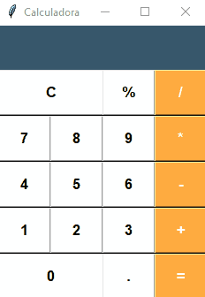

# 🐍🧮Calculadora Python 

## 📝 Descrição do projeto:
Projeto de uma calculadora simples em Python com interface gráfica, desenvolvida para praticar lógica de programação e criação de janelas com Tkinter. A calculadora realiza operações básicas como adição, subtração, multiplicação e divisão, tudo por meio de uma interface interativa e intuitiva.

## 🚀 Tecnologias usadas:

## 🖼 Demonstração do projeto:

## 👩‍💻 Autora:
Feito por ✨[Nathália Anastácio](https://github.com/nath-anastacio)✨
### 💬 Você pode me encontrar em:

  
  

